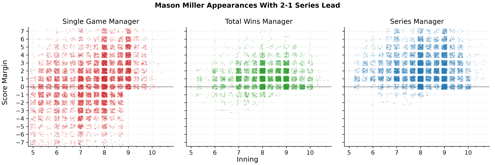

# How Important Is Winning Today? Optimizing Baseball Management Across Multiple Games

## Introduction

Baseball management decisions are often evaluated by their effect on current-game win probability ([Melville et al., 2025](https://www.sloansportsconference.com/research-papers/an-extensive-investigation-of-strategies-in-baseball); [Finigan et al., 2020](https://doi.org/10.1016/j.socec.2020.101591)). However, in a season with 162 regular-season games and relief pitchers who cannot pitch every day, winning a single game at all costs is often a shortsighted objective. While win probability can be a useful metric for decisions local to the current game, such as intentional walks or pinch-hitting, it overlooks the future consequences of pitching substitutions. In this work, we consider optimal management strategies when success means one of the following: winning today, accumulating total wins, or winning a series. We compare policies optimized for each of these three objectives and measure the performance tradeoffs between them.

## Methods

The "single-game manager" maximizes current-game win probability. The "total-wins manager" maximizes total expected wins over a five-game sequence. The "series manager" maximizes the probability of winning at least three games in a five-game series. Extending the methods of [Melville et al. (2025)](https://www.sloansportsconference.com/research-papers/an-extensive-investigation-of-strategies-in-baseball), we modeled baseball as an extensive-form, zero-sum, perfect-information game between managers. We computed approximate Nash equilibria according to player-specific matchup probability tables and fixed batting and pitching usage constraints for each of the three objectives.

We then simulated a five-game sequence between the 2026 All-Star teams for all nine home/away manager pairings (65,536 times each). In between games, reliever rest was sampled according to usage-dependent availability distributions. Each game used a ten-inning limit (ties assigned a winner with equal probability) and an eight-run deficit cutoff.

## Results

Table 1 shows how well each manager performed in their ideal context against the other two managers.

**Table 1. Head-to-head performance by objective.**

| Manager | Opponent | Metric | Win percentage | 95% CI |
| --- | --- | --- | ---: | ---: |
| Single game | Total wins | Game one | 50.72% | 50.45–51.00% |
| Single game | Series | Game one | 51.14% | 50.86–51.41% |
| Total wins | Single game | All games | 50.48% | 50.36–50.60% |
| Total wins | Series | All games | 50.03% | 49.91–50.15% |
| Series | Single game | Series | 50.96% | 50.69–51.23% |
| Series | Total wins | Series | 50.33% | 50.06–50.60% |

Figure 1 shows Mason Miller's entries in self-play games when his team led the series 2-1. Only 49% of his entries under the single-game manager occurred at score margins of 0-3 runs. The total-wins manager used him somewhat like a traditional closer, with 90% of entries in that window. The series manager used him in that window 75% of the time, with almost all remaining entries occurring at larger leads.

**Figure 1. Mason Miller's entries with a 2-1 series lead.**

## Conclusion

These findings can help teams generate wins by adjusting their strategies based on the various contexts they find themselves in throughout the season. For example, while something resembling the traditional closer role may be near optimal in a typical regular-season game (total-wins manager), it should be completely thrown out the window in game seven of a playoff series (single-game manager). On the other hand, when a team needs just one more win to clinch with multiple games remaining in a playoff series (series manager), they should use an even more extreme version of a closer who never pitches in a deficit and pitches even with large leads.
